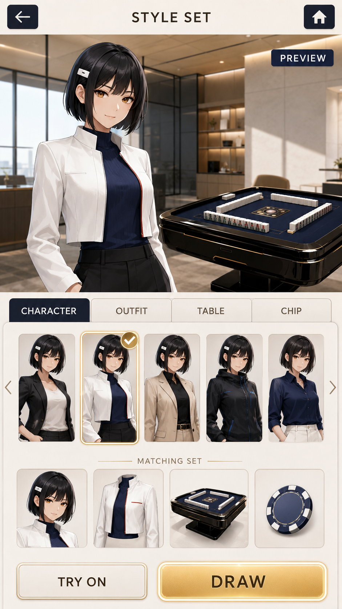
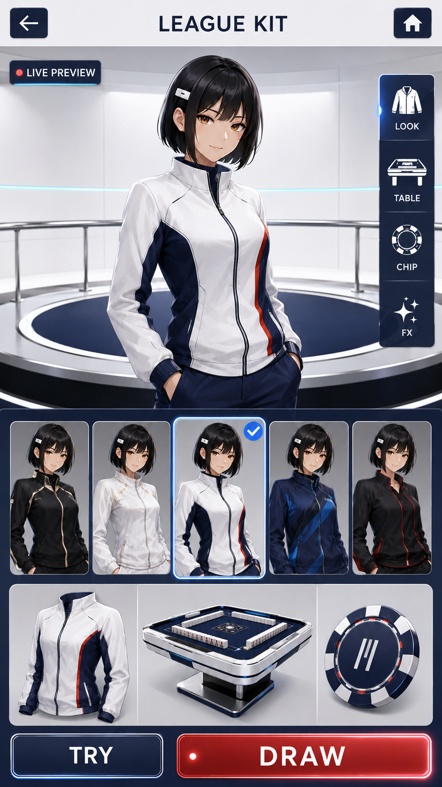
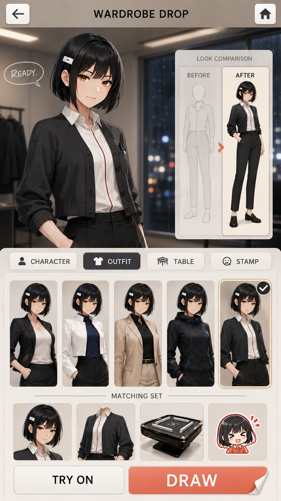
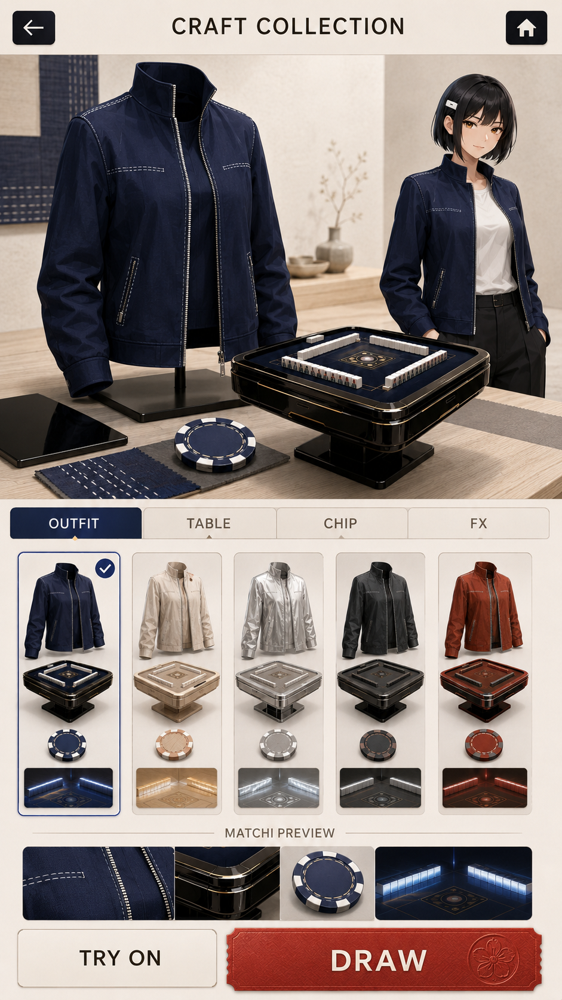
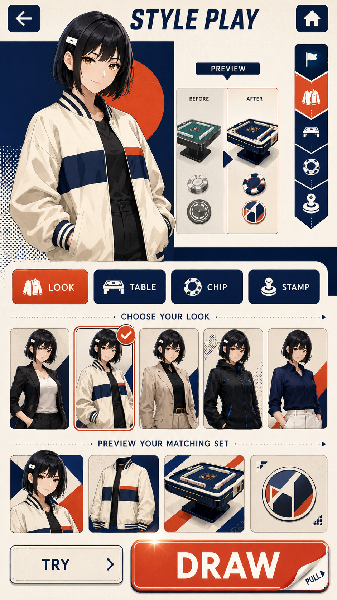

# Meta / Gacha Product Language — Japanese Reset

Date: 2026-08-16 JST  
Lane: Meta / Gacha Lab  
Status: **FIVE PROPOSALS READY FOR CONTROL TOWER REVIEW**

## User correction now binding

The first proof, `meta-gacha-clean-evolution-v1.png`, is **REJECTED** as a candidate.

Its jade, circular architectural frame, clothing details, ornament, and character dominance pushed the product too far toward a Chinese-coded fantasy. It also failed to explain whether the player was previewing a cosmetic, changing clothes, or entering a gacha. The screen created hesitation instead of desire.

MAHJONG HOLD'EM should prioritize a **contemporary Japanese atmosphere** that remains internationally legible and reusable. Japanese identity must come from restraint, material choices, typography, utility, contemporary fashion, and product behavior—not a pile of historical symbols.

## Binding visual exclusions

- No qipao / cheongsam collars, tang jackets, hanfu, robe silhouettes, tassels, dragons, phoenixes, Chinese calligraphy, moon gates, palace arches, circular windows, carved lattice, or imperial red-and-gold grammar.
- Jade is no longer a default brand material. It may appear only as a specific item color after approval.
- Do not substitute generic “Asian luxury” for Japanese identity.
- Also avoid Japanese cliché stacking: torii, tatami, shoji, sakura, brush lettering, and kimono are not a shortcut to product identity.
- Backgrounds stay simple, modular, low-detail, and independent from any single character.

## Benchmark lessons

| Proven pattern | Product lesson for MAHJONG HOLD'EM |
|---|---|
| Pokémon TCG Pocket links opening to binders and display boards | Acquisition becomes desirable when the player immediately understands how the reward will be displayed and used. |
| Project SEKAI separates member selection, live outfit, and final confirmation | Customization needs an explicit sequence: choose target → choose item → preview → confirm. |
| Long-running Japanese character games expose selected state, category tabs, single/multi draw, and a route back | Familiar usability should be solved conventionally; novelty belongs in the reward fantasy, not navigation. |
| Existing MAHJONG HOLD'EM precedent separates character, table, chip, all-in/showdown, nameplate, and stamp surfaces | Every collectible needs a visible destination inside lobby or match. |

Sources:

- [Pokémon TCG Pocket official launch release](https://press.pokemon.com/en/Pokemon-Trading-Card-Game-Pocket-Launches-Today-Offering-a-Fresh-Take-)
- [Project SEKAI official FAQ — live outfits](https://pjsekai.sega.jp/faq/index.html)
- [Uma Musume official character portal](https://umamusume.jp/character/)

## Shared UI grammar

Every meta / gacha concept must provide this visible order:

1. **Return:** obvious back arrow; home when useful.
2. **Purpose:** short screen title such as STYLE SET, LEAGUE KIT, WARDROBE DROP, CRAFT COLLECTION, or STYLE PLAY.
3. **Preview:** show exactly what changes in the character or match.
4. **Category:** character / outfit / table / chip / stamp / FX.
5. **Choice:** several alternatives at once, never a single isolated item.
6. **Selected state:** one unmistakable check or highlight.
7. **Consistency:** the main preview, selected thumbnail, garment card, table, and chip must depict the same set.
8. **Try:** preview without committing.
9. **Acquire:** one clearly dominant DRAW action.
10. **Use:** after acquisition, the route to wardrobe/equip must be obvious.

Final values, prices, odds, legal copy, localization, and accessibility remain code-rendered.

## Five visual proofs

### A — Japanese Premium Club

- Product fantasy: bright contemporary Tokyo/Ginza club.
- Strongest at: general-purpose lobby compatibility and premium calm.
- Character dependence: medium.
- Pull desire: medium-high through a tangible gold DRAW surface.
- Risk: can become a generic luxury game if Tokyo/Japanese utility cues weaken.

### B — Future League Japan

- Product fantasy: Japanese world-championship broadcast sport.
- Strongest at: immediate UI purpose, category scanning, competition identity.
- Character dependence: medium.
- Pull desire: high through signed-kit / team-uniform ownership.
- Risk: coldness; preserve human character moments outside the match.

### C — Character Showdown Japan

- Product fantasy: modern Tokyo backstage before a decisive match.
- Strongest at: “I want to become/play as this version” and before/after clarity.
- Character dependence: high.
- Pull desire: high through emotional transformation.
- Risk: character and story can overpower reusable product surfaces.

### D — Modern Japanese Craft

- Product fantasy: Japanese industrial craft applied to outfit, table, chip, and match FX.
- Strongest at: Japanese identity, object value, background reuse, low character dependence.
- Character dependence: low.
- Pull desire: medium-high through owning a coordinated material set.
- Risk: calmness can reduce urgency; interaction and reveal motion must supply anticipation.

### E — Japanese Graphic Pop

- Product fantasy: Tokyo editorial graphics and tactile arcade packaging.
- Strongest at: mobile readability, choice clarity, and the most tappable DRAW.
- Character dependence: medium.
- Pull desire: highest immediate click impulse.
- Risk: weak typography or materials could reduce premium perception.

## Comparison matrix

| Direction | Japanese identity | UI clarity | Character appeal | Draw desire | Reusability |
|---|---:|---:|---:|---:|---:|
| A Premium Club | 4 | 4 | 4 | 4 | 5 |
| B Future League | 3 | 5 | 4 | 4 | 5 |
| C Character Showdown | 4 | 5 | 5 | 4 | 3 |
| D Japanese Craft | 5 | 4 | 3 | 4 | 5 |
| E Graphic Pop | 4 | 5 | 4 | 5 | 4 |

Scores are Meta / Gacha Lab hypotheses, not user decisions.

## Proposed synthesis

The strongest combined product language is likely:

- **A** for reusable lobby/background structure;
- **B** for navigation and competition utility;
- **C** for character emotion and before/after presentation;
- **D** for Japanese material identity and object value;
- **E** for selected states and DRAW tactility.

Do not synthesize before the Control Tower records the three direct Japanese choices: 「この方向で進めたい」「良い部分だけ使いたい」「今回は使わない」.

## Exact Control Tower comparison request

Review A–E at 25% scale. For each image choose exactly one: **この方向で進めたい / 良い部分だけ使いたい / 今回は使わない**. If choosing partial use, note the useful part in plain Japanese.

